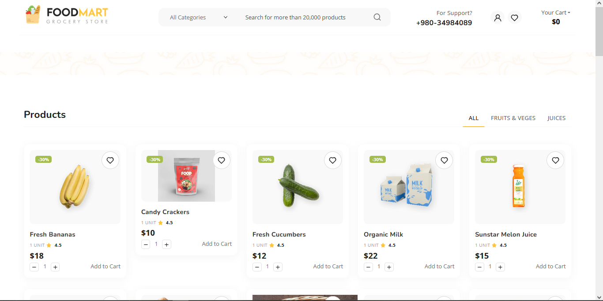

# JS Add to Cart Demo

This is a simple eCommerce cart demo built with HTML, CSS, and JavaScript. It features a product grid, add-to-cart functionality, cart management with localStorage, and a checkout page.

Deploy Link:- https://js-add-to-cart.vercel.app/

## Features
- Product listing with images, price, rating, and quantity controls
- Add to cart, update quantity, and remove items
- Cart stored in browser localStorage
- Offcanvas cart sidebar with live updates
- Checkout page with order form and cart summary

## File Structure
- `index.html` — Main shop page
- `checkout.html` — Checkout form and cart summary
- `js/main.js` — Main JavaScript logic for cart and products
- `js/products.json` — Product data
- `style.css` — Custom styles
- `css/` — Vendor and utility CSS
- `images/` — Product and UI images

## Usage
1. Open `index.html` in your browser.
2. Browse products and add them to your cart.
3. Click the cart icon to view or remove items.
4. Click "Continue to checkout" to fill out the order form.

## Customization
- Add or edit products in `js/products.json`.
- Adjust styles in `style.css` or `css/`.

## Credits
- Template by TemplatesJungle
- Bootstrap 5, Swiper.js, and other open source libraries

---
This project is for demo and educational purposes only.
